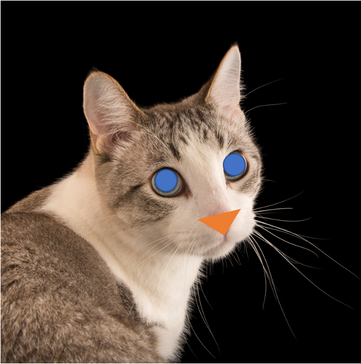
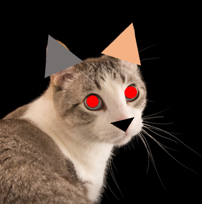
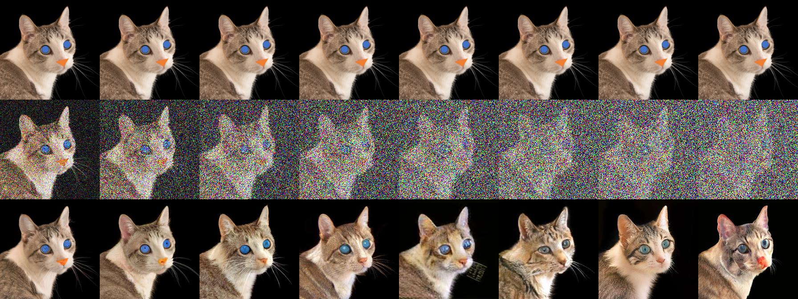
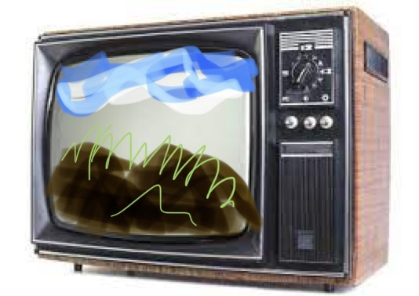
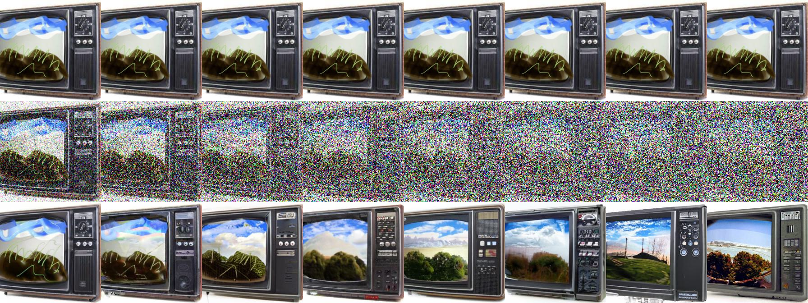
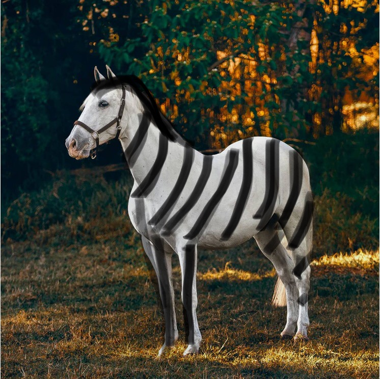
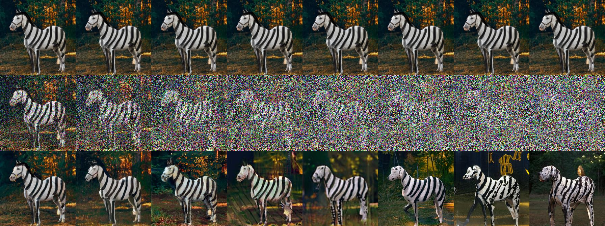

Personal Repo for Simple Image Editing based on Denoising Diffusion Model

Reference:
https://github.com/openai/guided-diffusion


## Some results:

```
Column : sigma = arange(start=0.5, end=4, step=0.5)

Row : Edit-image + Diffused-image + Recovered-image
```

### cat edit


 

CAT-(1)

CAT_(2)


### tv-edit



TV-(1)



### horse-edit



HORSE-(1)



